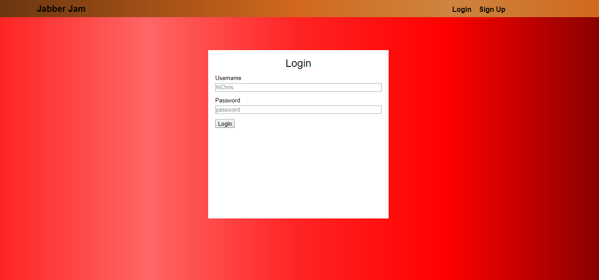
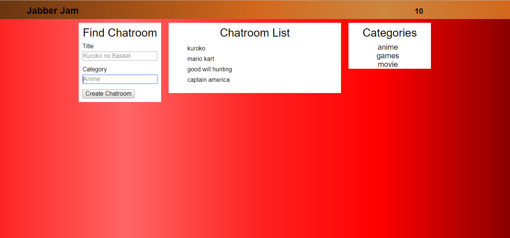
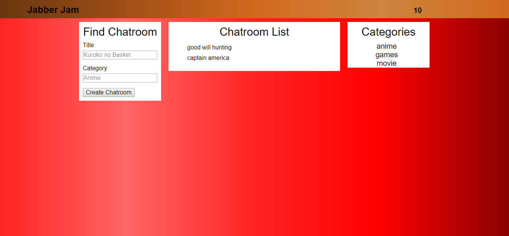
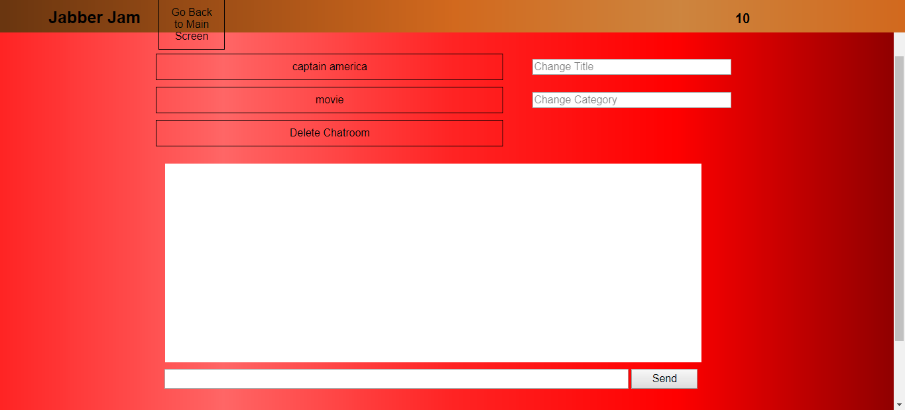
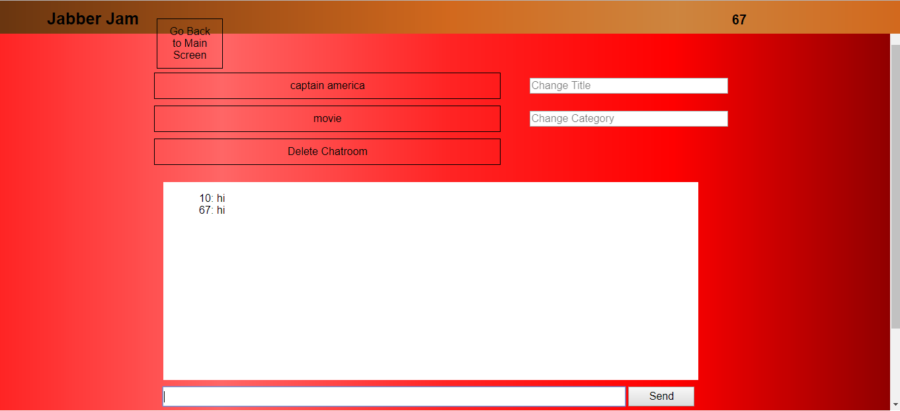

## Title:  
#### Jabber Jam

## Description 
Jabber Jam is a chatroom app that allows user to meet new people that are also interested in a certain category or certain topic. In order to use Jabber Jam, you will first need to create an account and then log in. Once you logged in, you will be able to see a list of chatrooms that are already created. You can filter this list by click on one of the categories at the right. If you can't find the chatroom you want in a certain category, you can create a chatroom in which you will need to enter the title and category of your chatroom. Once you created the chatroom, you will see your chatroom there and you will need to click on it to go in. From there, you can start talking about the topic, change the title and category, and delete the chatroom.

## Technology Used: 
**FrontEnd**: HTML, CSS, Javasript, jQuery 
**BackEnd**: NodeJs, Express, MongoDB, Mongoose, Mlab  
**Deployment**: Heroku, Travis   

## Documentation of API  
**GET** https://jabber-jam.herokuapp.com/chatrooms  
**GET** https://jabber-jam.herokuapp.com/chatrooms/:id  
**GET** https://jabber-jam.herokuapp.com/chatrooms/distinct  
**POST** https://jabber-jam.herokuapp.com/chatrooms  
**PUT** https://jabber-jam.herokuapp.com/chatrooms/:id      
**DELETE** https://jabber-jam.herokuapp.com/chatrooms/:id  

## How to use our code  
Fork it to your repo.  
git clone repo_link  
npm install  
make sure mongodb is installed  
run mongod  
run npm start  
go to localhost:8080 in browser 

## Screenshots  
#### SignUp Screen  
When you signup, you go to log in screen 
 

#### Login Screen  
When you login, you go to main screen 
 

#### MainScreen  
This screen shows all chatrooms and all categories. You can also create chatroom from this screen.
 

#### Filter  
When you click on one of the categories, it shows list of chatrooms in that category. When you click on one of the chatrooms, it will lead you to the chatroom page. 
 

#### Chatroom  
In this screen, you can update title and category, send messages, delete chatroom, or go back to main page.
 

#### Sending a Message  
You can press your enter key or click send to send the message.

