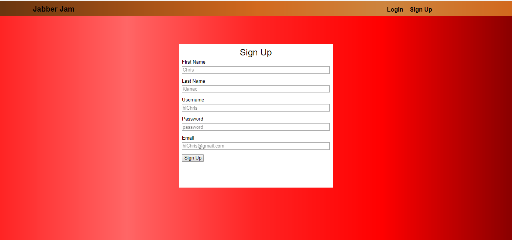

Title: Jabber Jam

## Description 
Jabber Jam is a chatroom app that allows user to meet new people that are also interested in a certain category or certain topic. In order to use Jabber Jam, you will first need to create an account and then log in. Once you logged in, you will be able to see a list of chatrooms that are already created. You can filter this list by click on one of the categories at the right. If you can't find the chatroom you want in a certain category, you can create a chatroom in which you will need to enter the title and category of your chatroom. Once you created the chatroom, you will see your chatroom there and you will need to click on it to go in. From there, you can start talking about the topic, change the title and category, and delete the chatroom.

Technology Used: 
FrontEnd: HTML, CSS, Javasript, jQuery 
BackEnd: NodeJs, Express, MongoDB, Mongoose, Mlab  
Deployment: Heroku, Travis   

**Screenshots** 
SignUp Screen 

